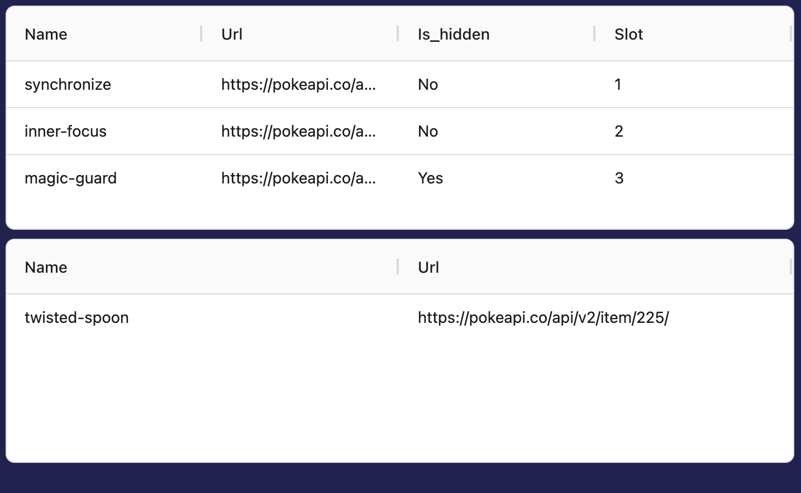

# Pokemon Data Table Task

## Basic Requirements

- Create a custom wrapper hook that uses `@tanstack/react-query` to fetch data from the following Pokemon API endpoint:

```
https://pokeapi.co/api/v2/pokemon/alakazam
```

- You can check the shape of the returned data by logging the response or by checking the API documentation at https://pokeapi.co/
- Alakazam has a list of **abilities** and **held items** returned as part of his data.
- **Create a table for both of these, by using `ag-grid-react` or your preferred react table library** _(ag-grid-react has been added to this project alredy, but if you want to use your own, you need to add it yourself)_

**You can use the internet** to search the docs of React Query and Ag Grid, or for any other help you might need.

Please explain the relevant part of your thought process as you go along.

<hr />


